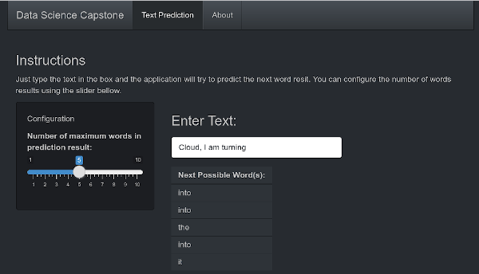

```{r setup, include=FALSE, echo=F}
knitr::opts_chunk$set(echo = FALSE)
library(dplyr)
library(tibble)
library(tidyverse)
library(stringi)
library(stringr)
library(tm)
```


## Overview

This is a presentation about the application to predict the possible next word based on a text typing in english language.

The application is running in shinyapps.io:

<https://luizcarlos.shinyapps.io/DataScienceCapstone/>

The source code is availabled in the Github page:
<https://github.com/luizcarlosk2/DataScienceCapstone>

The prediction text is based in data texts from news, blogs and twitter in english language located in this  [link](https://d396qusza40orc.cloudfront.net/dsscapstone/dataset/Coursera-SwiftKey.zip).

## Model deployed

The model deployed in the application is based in the sequence of words (grammar sequence), the most possible word based in 2 levels:

- Number of words
- Most possible word used with highest to lowest probability

A database was created from 1 to 3 words and the next possible word prediction.

The algorithm works from 3 to 1 sequence of words, and try to predict the next word. if the last 3 words from a phrase is not found in the database, it will take the last 2 words and so on, until the one last word from the text input.

from each level of N-Grams, it will take the most possible word based in the statistically probability (weight) of next word.

## Model Example

```{r, include=FALSE, echo=F}
df_prediction <- readRDS("../data/df_prediction.rds")


predict_ngram <- function(sentence_input, maxresult = 3){
    removelinks <- function(x) {gsub("?(f|ht)tp(s?)://(.*)[.][a-z]+", "", x)}
    sentence_input <- tolower(sentence_input)
    sentence_input <- str_squish(sentence_input)
    sentence_input <- removelinks(sentence_input)
    sentence_input <- removePunctuation(sentence_input)
    
    partial_answer <- tibble(value = character(),
                     n = integer(),
                     level = double(),
                     prediction = character())
    
    answer <- partial_answer
    
    #answer <- multigram %>% filter(sentence_input == value)
    
    while(sapply(strsplit(sentence_input, " "), length) > 0){
        partial_answer <- df_prediction %>% filter(sentence_input == value) #%>% filter(prediction %in% sentence_options)
        #print(answer)
        #print(sentence_input)
        ifelse (sapply(strsplit(sentence_input, " "), length) <= 1, sentence_input <- "", sentence_input <- sub(".+? ", "", sentence_input))
        #print(head(answer,1))
        answer <- rbind(answer,partial_answer)
    }
    answer %>% head(maxresult)
    
}


```

Phrase input: **_Cloud, I am turning_**, with a maximum of **5** results

```{r, include=T, echo=F}
knitr::kable(predict_ngram("Cloud, I am turning", 5), align = "lccrr",digits=4)
```


## The Aplication

 


